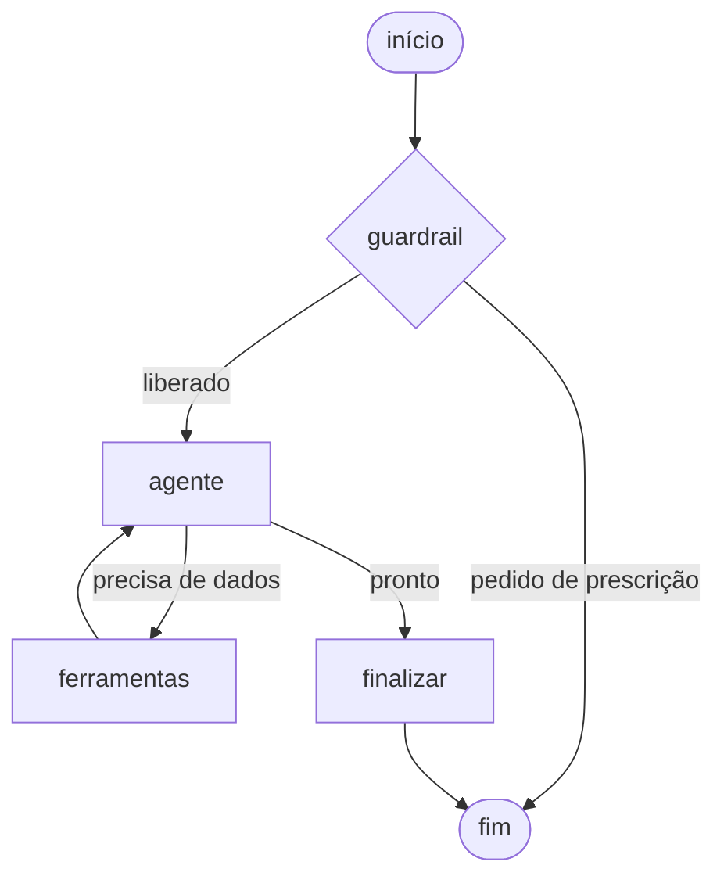

# Assistente clínico

Assistente que responde perguntas de médicos usando os **dados do próprio hospital**: consulta o prontuário do paciente, sugere tratamentos com base nos protocolos internos e marca consultas na agenda, sempre carimbando a resposta como sugestão que precisa ser revisada por um médico.

Tech Challenge Fase 3 · 9IADT.

---

## Rodando

Precisa de Docker, Python 3.11+ e uma chave da OpenAI.

```bash
pip install -r requirements.txt
docker compose up -d
cp .env.example .env       # e coloque a sua OPENAI_API_KEY
python main.py setup       # carrega o banco e calcula os embeddings (uma vez)
python main.py             # conversa com o assistente
```

Dentro da conversa: `/paciente P-0002` troca o paciente em foco, `sair` encerra.

---

## O que ele faz

**Lista dados do paciente**: nome, idade, doenças, alergias, medicamentos em uso, exames com valor e faixa de referência, e as consultas marcadas.

**Sugere tratamentos**: busca nos protocolos internos do hospital por similaridade semântica e cita a seção que usou, no formato `(PROT-PNM-06 - Antibioticoterapia empirica)`. Se o protocolo não cobre o caso, ele diz isso em vez de responder com conhecimento geral.

**Marca consultas**: grava em `clinical.consultas` que ficam pendentes de confirmação.

---

## O fluxo



Quatro nós. O que o desenho garante:

- **Toda pergunta passa pelo `guardrail`.** classifica se o médico está pedindo uma prescrição direta e, se estiver, recusa antes de qualquer consulta ao banco.
- **Nenhuma resposta chega ao médico sem passar por `finalizar`.** Não existe aresta do `agente` direto para o fim, e é em `finalizar` que o carimbo de revisão humana é aplicado.
- O laço `agente ⇄ ferramentas` é o ReAct, com teto de 5 iterações.

O guardrail bloqueia *"Prescreva 40mg de furosemida agora"* e libera *"O que o protocolo recomenda para insuficiência cardíaca descompensada?"*. A diferença é pedir que ele prescreva versus perguntar o que a instituição estabelece.

---

## Os dados

Tudo em SQL estático, montado no `docker-entrypoint-initdb.d`. O `docker compose up -d` já sobe o banco populado.

| Arquivo | Conteúdo |
|---|---|
| `db/001_schema.sql` | Os três schemas e suas tabelas |
| `db/002_seed_clinical.sql` | 50 pacientes, 138 atendimentos, 361 exames, 291 prescrições |
| `db/003_seed_knowledge.sql` | 25 protocolos internos em 109 trechos |

Os dados são sintéticos, ou seja, nenhum paciente real. Os instantes são escritos como `now() - interval '4 hours'` em vez de data fixa, para que os casos preparados não envelheçam e parem de fazer sentido.

Cinco pacientes ocupam as primeiras linhas do seed clínico, cada um com uma situação diferente para testar:

| | Situação |
|---|---|
| `P-0001` | Dor torácica, troponina alterada, ECG ainda pendente |
| `P-0002` | Em uso de varfarina, com INR alto |
| `P-0003` | Alergia grave a penicilina, com penicilina ativa na prescrição |
| `P-0004` | Insuficiência cardíaca e doença renal, potássio alto |
| `P-0005` | Caso de rotina, sem nada fora do lugar |

Os embeddings ficam `NULL` nos arquivos e são calculados pelo `python main.py setup`.

---

## Auditoria

Duas tabelas em `audit`: uma linha por sessão e uma por passo, nó do grafo executado, ferramenta chamada, decisão do guardrail. O `detalhe` vai em `jsonb`.

#### Consultas de auditoria úteis

Reconstruir o que o assistente fez numa sessão:

```sql
SELECT e.ordem, e.tipo, e.nome, e.latencia_ms, e.detalhe
  FROM audit.eventos e
  JOIN audit.sessoes s ON s.id = e.sessao_id
 ORDER BY s.iniciada_em DESC, e.ordem
 LIMIT 20;
```

```
 ordem |    tipo    |       nome        | latencia_ms
-------+------------+-------------------+-------------
     1 | no         | guardrail         |        1567
     2 | guardrail  | prescricao_direta |
     3 | no         | agente            |         993
     4 | ferramenta | buscar_protocolo  |
     5 | no         | agente            |        3413
     6 | no         | finalizar         |
```

Outras perguntas úteis:

```sql
-- quantas perguntas o guardrail bloqueou
SELECT count(*) FROM audit.sessoes WHERE status = 'bloqueada';

-- quais ferramentas o assistente mais usa
SELECT nome, count(*) FROM audit.eventos WHERE tipo = 'ferramenta'
 GROUP BY nome ORDER BY 2 DESC;

-- custo em tokens por sessão
SELECT pergunta, tokens_entrada, tokens_saida FROM audit.sessoes
 ORDER BY iniciada_em DESC LIMIT 10;
```

---

## Estrutura

```
main.py                    ponto de entrada: chat e setup
assistente/
  config.py                lê o .env
  db.py                    engine e helpers de consulta
  llm.py                   os três modelos da OpenAI
  tools.py                 as 5 ferramentas que o assistente pode chamar
  grafo.py                 o LangGraph: 4 nós, prompts e o guardrail
  auditoria.py             grava o registro das sessões
  indexar.py               calcula os embeddings dos protocolos
db/                        schema e dados, em SQL
```

---